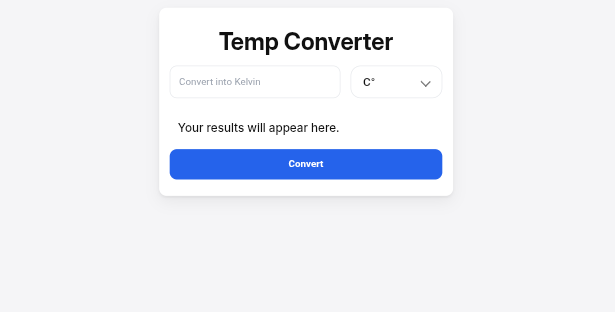

# Kelvin Temperature Converter

A simple, user-friendly web application built with HTML, CSS, and JavaScript that converts temperatures from Kelvin to both Celsius and Fahrenheit.



## Features

- **Kelvin-Centric Conversion**: Primarily focused on Kelvin input, with instant conversion to Celsius and Fahrenheit.
- **Bidirectional Logic**: While optimized for Kelvin input, the underlying conversion functions can be easily adapted for other temperature scales.
- **Clean Interface**: A minimalist and intuitive design for a seamless user experience.
- **Responsive Design**: Works flawlessly on both desktop and mobile devices.

## Demo

👉 [Live Demo on GitHub Pages](https://besuhosiso.github.io/Temp-Converter/)

*(Replace the link above with your actual GitHub Pages URL)*

## Technologies Used

- **HTML5**: For the basic structure and input fields.
- **CSS3**: For styling, layout, and visual presentation.
- **JavaScript**: For handling the conversion logic and dynamic updates.

## How to Use

1. Enter a temperature value in Kelvin in the input field and click convert button.
2. The converter instantly displays the equivalent values in Celsius and Fahrenheit.
3. Clear the input to start over.

### Conversion Formulas Used

- **Kelvin to Celsius**:  
  `°C = K − 273.15`

- **Kelvin to Fahrenheit**:  
  `°F = (K − 273.15) × 9/5 + 32`

## Local Development

To run this project locally:

1. Clone the repository:
   ```bash
   git clone https://github.com/your-username/kelvin-temperature-converter.git
